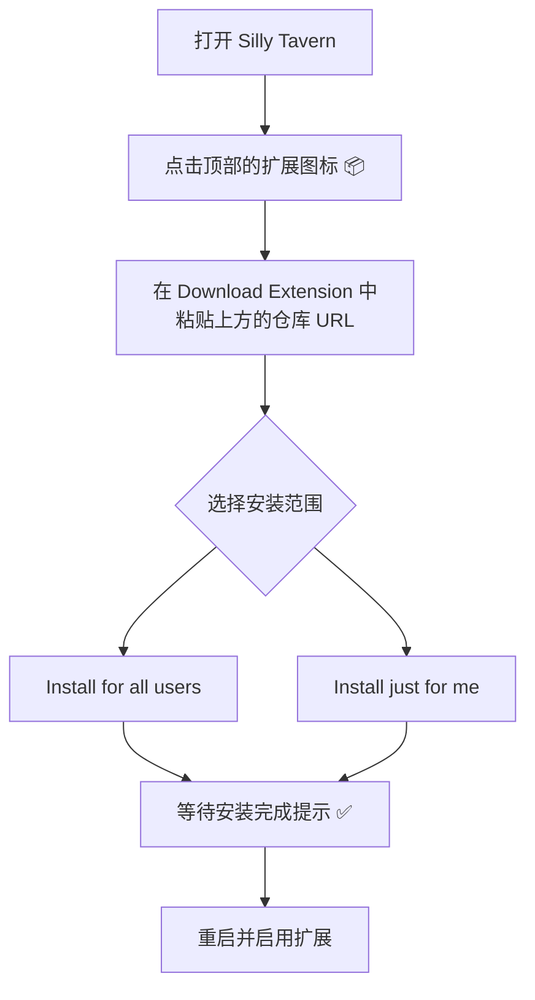

# Response Linter

一个强大的 SillyTavern 扩展，用于实时监控和智能修复 AI 回复格式。


## 📋 功能概览

Response Linter 是一个专为 SillyTavern 设计的扩展，能够：

- ⚡ **实时验证** - 在 AI 回复渲染前自动检测格式问题
- 🎯 **位置感知验证** - 智能检测标签的位置和顺序关系
- 🔧 **智能自动修复** - 基于多种策略自动修复常见格式问题
- 📊 **详细错误报告** - 提供具体的错误类型和位置信息
- 🎨 **直观配置界面** - 简洁易用的规则管理和配置向导
- 📈 **统计分析** - 实时监控验证和修复效果

## 🚀 快速开始

### 安装

#### 方法一：通过 Git 克隆安装（适合开发者）

1.  **进入扩展目录**
    打开终端或命令行工具，进入 SillyTavern 的第三方扩展目录。
    ```bash
    cd SillyTavern/public/scripts/extensions/third-party/
    ```
2.  **克隆仓库**
    使用 `git clone` 命令下载本仓库。
    ```bash
    git clone https://github.com/il1umi/Response-Linter.git
    ```
3.  **重启并启用**
    - 重启您的 SillyTavern 实例。
    - 打开 "扩展" 面板，找到 "Response Linter" 并启用。

#### 方法二：通过 URL 在线安装（酒馆内直装，推荐）

这是一个更简单快捷的安装方式，直接在 SillyTavern 界面内完成。请复制以下 URL 地址：
`https://github.com/il1umi/Response-Linter`



### 基础使用

1. **启用验证**
   - 在扩展面板中打开"启用验证"开关

2. **创建验证规则**
   - 使用"快速添加常用规则模板"或"添加新规则"
   - 配置必需标签和修复策略

3. **启用智能修复**（可选）
   - 开启"启用智能修复"以自动修复检测到的问题

4. **开始对话**
   - 与 AI 正常对话，扩展会自动监控格式

## 🎯 核心功能详解

### 验证引擎

#### 位置感知验证
- **顺序检测**：确保标签按预期顺序出现
- **完整性检查**：验证配对标签的完整性
- **内容位置分析**：检测标签在文本中的具体位置

#### 错误分类
- 🔴 **标签缺失**：检测缺少的必需标签
- 🟡 **顺序错误**：标签出现但顺序不正确
- 🟠 **配对不完整**：开始标签存在但缺少结束标签

### 智能修复系统

#### 修复策略

1. **思维链修复策略** (`ThinkingContentFixStrategy`)
   - 自动处理 `</thinking>` 后缺失 `<content>` 的情况
   - 智能添加内容包装标签

2. **缺失标签修复策略** (`MissingTagsFixStrategy`)
   - 自动补全缺失的配对标签
   - 智能判断插入位置

3. **位置感知修复策略** (`PositionalFixStrategy`)
   - 基于内容上下文的智能修复
   - 支持双换行符分隔模式
   - 针对不同场景的个性化修复逻辑

4. **自定义修复策略** (`CustomFixStrategy`)
   - 支持用户定义的正则表达式修复规则
   - 灵活的替换模式配置

### 用户界面

#### 主控制面板
- **扩展状态控制**：启用/禁用验证和修复功能
- **规则管理器**：添加、编辑、删除验证规则
- **通知设置**：配置错误提示的显示方式
- **统计显示**：实时查看验证和修复统计

#### 规则编辑器
- **直观配置界面**：简单易用的规则创建向导
- **拖拽排序**：可视化调整标签检测顺序
- **实时预览**：即时查看修复策略效果
- **模板支持**：预置常用规则模板

#### 配置向导
- **分步指导**：四步配置流程，新手友好
- **模式选择**：思维链、结构化、自定义三种模式
- **测试功能**：配置完成后即时测试验证效果

## 📖 使用指南

### 创建验证规则

#### 方法一：使用模板（推荐新手）

1. 点击"快速添加常用规则模板"
2. 选择合适的模板：
   - **思维链模板**：验证 `<thinking>` 和 `<content>` 结构
   - **代码块模板**：验证代码标签的完整性
   - **问答模板**：验证问答格式的标准化

#### 方法二：使用配置向导

1. 点击"配置向导"按钮
2. 选择验证模式
3. 配置必需内容
4. 测试验证规则
5. 完成配置

#### 方法三：手动创建

1. 点击"添加新规则"
2. 填写规则信息：
   - **规则名称**：便于识别的名称
   - **规则描述**：详细说明规则用途
   - **必需内容**：需要验证的标签列表
   - **修复策略**：选择适当的自动修复方式

### 配置修复策略

#### 位置感知修复（推荐）
- 智能分析内容上下文
- 在最合适的位置插入缺失标签
- 支持双换行符分隔，保持格式美观

#### 思维链修复
- 专门处理思维链格式问题
- 自动在 `</thinking>` 后添加 `<content>` 标签

#### 缺失标签修复
- 通用的标签补全策略
- 适用于各种配对标签场景

#### 自定义修复
- 使用正则表达式定义修复规则
- 高度灵活，适合特殊需求

### 理解验证结果

#### 通知类型
- **成功**：回复通过所有验证规则
- **警告**：发现格式问题但可以修复
- **错误**：发现严重格式问题

#### 详细信息
- **错误类型**：标签缺失、顺序错误、配对不完整
- **具体位置**：问题出现的行号和位置
- **修复建议**：推荐的修复方案

## ⚙️ 高级配置

### 性能优化

#### 验证设置
- **防抖延迟**：避免频繁验证影响性能
- **消息缓存**：防止重复处理相同消息
- **内存管理**：自动清理过期的处理记录

#### 修复设置
- **修复队列**：按优先级处理修复任务
- **确认机制**：重要修复需要用户确认
- **撤销功能**：支持撤销最近的修复操作

### 扩展开发

#### 自定义修复策略
```javascript
// 创建自定义修复策略
const myStrategy = new CustomFixStrategy(
  '(</thinking>)(?!\\s*<content>)', // 正则模式
  '$1\n\n<content>\n',              // 替换内容
  '自定义思维链修复'                 // 策略描述
);

// 注册策略
autoFixEngine.registerStrategy('my-custom', myStrategy);
```

#### 事件监听
```javascript
// 监听验证事件
eventSource.on('responseLinter.validationFailed', (result) => {
  console.log('验证失败:', result);
});

// 监听修复事件
eventSource.on('responseLinter.fixApplied', (result) => {
  console.log('修复完成:', result);
});
```

## 📊 统计与监控

### 验证统计
- **总验证次数**：扩展启动以来的验证总数
- **失败验证次数**：发现问题的验证次数
- **成功率**：验证通过的百分比

### 修复统计
- **修复尝试次数**：自动修复的尝试次数
- **修复成功次数**：成功修复的次数
- **用户取消次数**：用户拒绝修复的次数
- **修复成功率**：修复成功的百分比

### 性能监控
- **平均验证时间**：每次验证的平均耗时
- **内存使用情况**：扩展的内存占用
- **错误日志**：记录运行中的异常情况

## 🔧 故障排除

### 常见问题

#### 扩展无法加载
1. 检查文件路径是否正确
2. 确认 `manifest.json` 格式正确
3. 查看浏览器控制台错误信息

#### 验证不生效
1. 确认扩展已启用
2. 检查是否有活跃的验证规则
3. 验证规则配置是否正确

#### 修复功能异常
1. 确认智能修复已启用
2. 检查修复策略配置
3. 查看修复历史记录

### 调试模式

启用调试模式查看详细日志：
```javascript
// 在浏览器控制台中执行
window.responseLinterDebug = true;
```

### 重置设置

如需重置所有设置：
```javascript
// 清除所有配置
delete extension_settings['response-linter'];
location.reload();
```

##  贡献指南

欢迎社区贡献！请遵循以下步骤：

1. **Fork 项目**
2. **创建功能分支** (`git checkout -b feature/XFeature`)
3. **提交更改** (`git commit -m 'Add some XFeature'`)
4. **推送分支** (`git push origin feature/XFeature`)
5. **创建 Pull Request**

### 开发环境

- Node.js 16+
- SillyTavern 最新版本
- 支持 ES6 模块的现代浏览器

### 代码规范

- 遵循 ES6+ 标准
- 保持高内聚低耦合的架构设计

## 📄 许可证

本项目采用 GNU AGPLv3 许可证 - 查看 [LICENSE](LICENSE) 文件了解详情。

### 版权信息

Copyright (C) 2025 il1umi

##  支持与反馈

- **Issues**：[GitHub Issues](https://github.com/il1umi/Response-Linter/issues)
- **讨论**：[GitHub Discussions](https://github.com/il1umi/Response-Linter/discussions)
